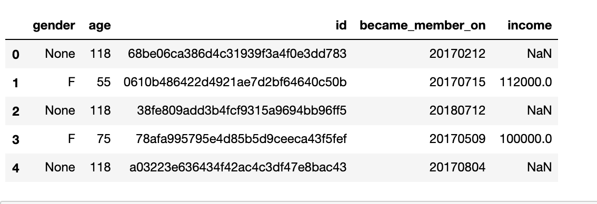
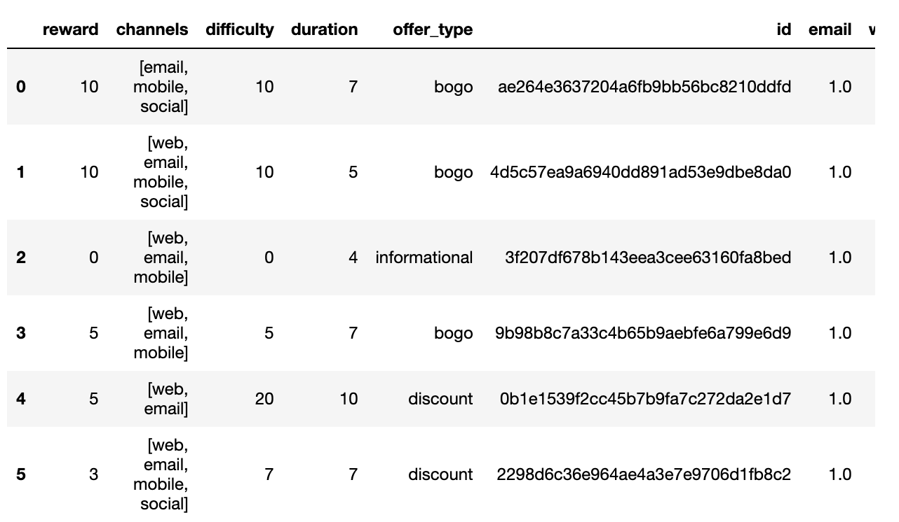
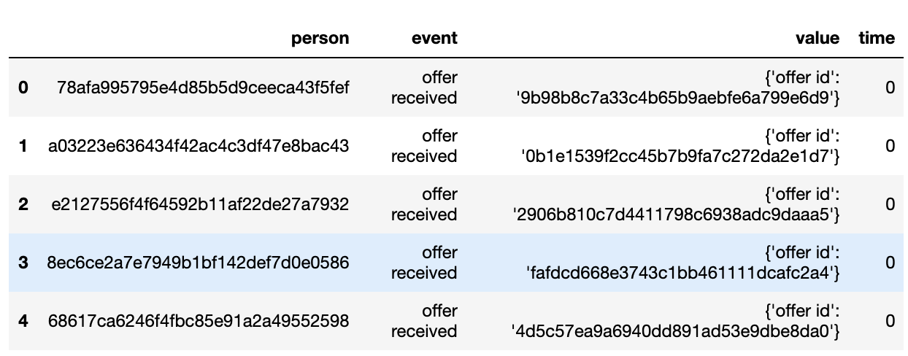

## Machine Learning Engineer Capstone Project
## Capstone Proposal
##### Yemi Awosanya 
###### April 21, 2021

### Section 1
#### 1.1 Domain background
Starbucks is passionate about improving and uplifting the lives of its customers, one beverage at a time. In doing so, they have created a mobile application that rewards and sends offers to their valued customers. The application offers promotions such as discounts or buy-one-get-one-free (BOGO), and occasionally, informational offers.

We will be using the study of consumer behavior to see how marketing campaigns can be adapted and improved to more effectively influence the consumer.

#### 1.2 Problem statement

Because of Starbucks' dedication to their customers, we will be analyzing customer data to explore ways of improving their experience and to serve them better. That said, this project aims to predict whether or not a customer will respond to an offer based on how each customer makes purchasing decisions.

#### 1.3 Datasets and inputs
We have three datasets as follows:

**profile.json**

`Rewards program users (17000 users x 5 fields)`
- gender: (categorical) M, F, O, or null
- age: (numeric) missing value encoded as 118
- id: (string/hash)
- became_member_on: (date) format YYYYMMDD
- income: (numeric)
  

**portfolio.json**

`Offers sent during 30-day test period (10 offers x 6 fields)`

- reward: (numeric) money awarded for the amount spent
- channels: (list) web, email, mobile, social
- difficulty: (numeric) money required to be spent to receive reward
- duration: (numeric) time for offer to be open, in days
- offer_type: (string) bogo, discount, informational
- id: (string/hash)

**transcript.json**

`Event log (306648 events x 4 fields)`

- person: (string/hash)
- event: (string) offer received, offer viewed, transaction, offer completed
- value: (dictionary) different values depending on event type
- offer id: (string/hash) not associated with any "transaction"
- amount: (numeric) money spent in "transaction"
- reward: (numeric) money gained from "offer completed"
- time: (numeric) hours after start of test

#### 1.4 Solution statement
We will create a machine learning model to predict if a user will accept an offer or not. The process to a clean solution is listed below:

1. Data Cleanup - This includes dropping or filling null/empty cells, removing duplicates, etc
2. Data Analysis- This includes feature engineering, etc
3. Data Visualizations - Visual representation of our data, to provid more inisights
4. Model Training - Train model using the algorithms discussed in the benchmark section
5. Model Analysis - Evaluate how well the model performs using the evaluation metrics

#### 1.5 Benchmark model
For the benchmark model, we will be using the GradientBoostingClassifier. Also, we will be exploring the xgboost algorithm from sklearn.

#### 1.6 Evaluation metrics
We will be using the following metrics to evaluate my model:
1. roc_auc_score - Area Under the Receiver Operating Characteristic Curve (ROC AUC) from prediction scores
2. accuracy_score - The number of correct predictions made divided by the total number of predictions made
3. f1_score - Weighted average of the precision and recall, where an F1 score reaches its best value at 1

#### 1.7 Project design
We will go over the three datasets provided; remove inavlid or null values, drop duplicates, fill columns with mean/mode/median values, etc. 

In other to see the relationship(s) between customer traits that influences a customer's buying power, we will combine all cleaned datasets, and plot graphs. Usually, this step influences the generation of new features that can be used to build an excellent predictive model. 

We will split the final, cleaned data into training and testing datasets. Train our model and see how well it predicts if a customer/user will respond an offer or not.

#### 1.8 References
- [Feature Selection](https://towardsdatascience.com/feature-selection-techniques-in-machine-learning-with-python-f24e7da3f36e)
- [Evaluate Gradient Boosting Models](https://machinelearningmastery.com/evaluate-gradient-boosting-models-xgboost-python/)
- [Getting Started with XGBoost](https://towardsdatascience.com/getting-started-with-xgboost-in-scikit-learn-f69f5f470a97)
- [Categorical Data Encoding](https://www.analyticsvidhya.com/blog/2020/08/types-of-categorical-data-encoding/)