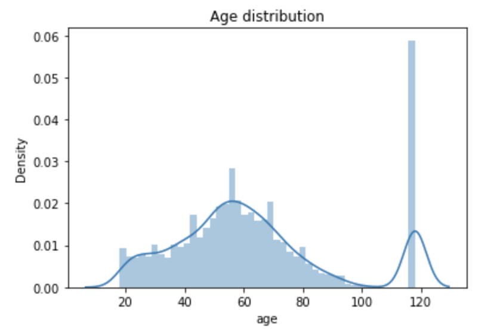
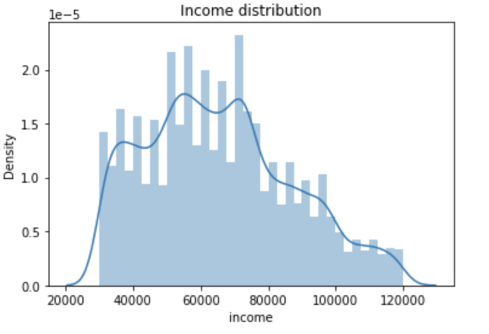
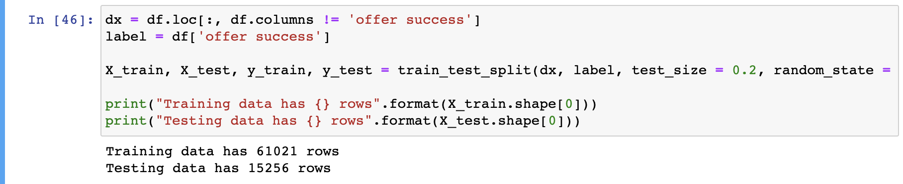
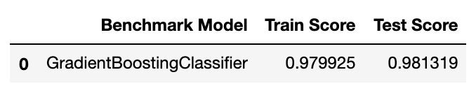
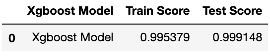
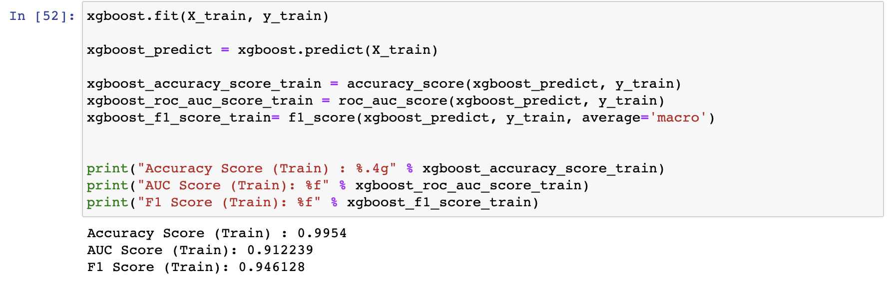
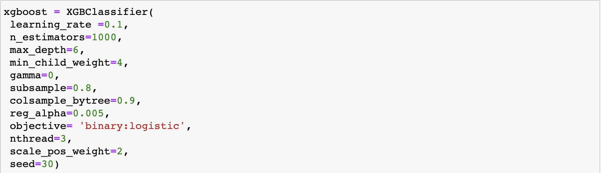
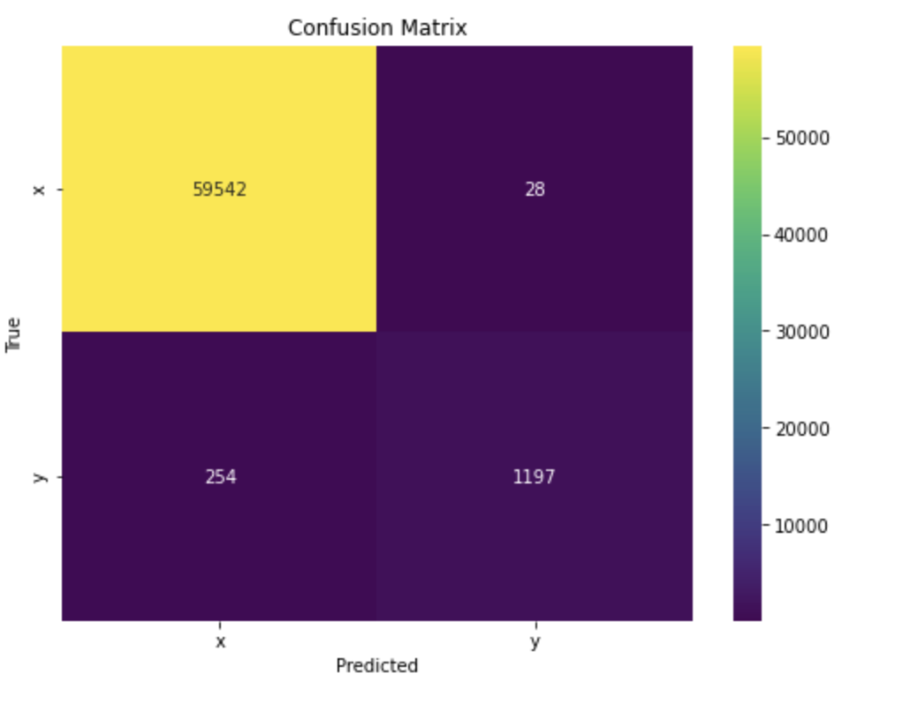
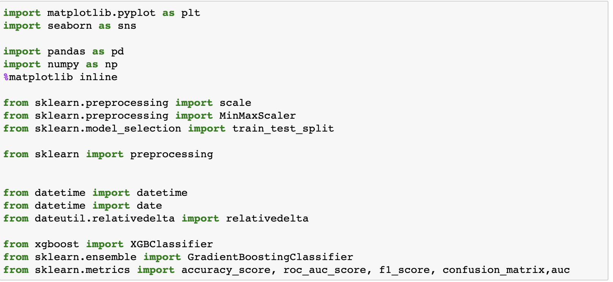

## Machine Learning Engineer Capstone Project
## Capstone Proposal
##### Yemi Awosanya 
###### April 23, 2021

### Table of Contents

#### 1. Definition
##### 1.1 Project Overview
##### 1.2 Problem Statement
##### 1.3 Metrics
#### 2. Analysis 
##### 2.1 Data Exploration
##### 2.2 Exploratory Visualization
##### 2.3 Algorithms and Techniques
##### 2.4 Benchmark
#### 3. Methodology
##### 3.1 Data Preprocessing
##### 3.2 Refinement
#### 4. Results
##### 4.1 Model Evaluation and Validation
##### 4.2 Justification
#### 5. Conclusion
##### 5.1 Reflection
#### 6. References 

#### Definition

##### Project Overview
This data set contains simulated data that mimics customer behavior on the Starbucks rewards mobile app. Once every few days, Starbucks sends out an offer to users of the mobile app. An offer can be merely an advertisement for a drink or an actual offer such as a discount or BOGO (buy one get one free). Some users might not receive any offer during certain weeks.

Not all users receive the same offer, and that is the challenge to solve with this data set.

Your task is to combine transaction, demographic and offer data to determine which demographic groups respond best to which offer type. This data set is a simplified version of the real Starbucks app because the underlying simulator only has one product whereas Starbucks actually sells dozens of products.

Every offer has a validity period before the offer expires. As an example, a BOGO offer might be valid for only 5 days. You'll see in the data set that informational offers have a validity period even though these ads are merely providing information about a product; for example, if an informational offer has 7 days of validity, you can assume the customer is feeling the influence of the offer for 7 days after receiving the advertisement.

##### Problem Statement
Starbucks is passionate about improving and uplifting the lives of its customers, one beverage at a time. In doing so, they have created a mobile application that rewards and sends offers to their valued customers. The application offers promotions such as discounts or buy-one-get-one-free (BOGO), and occasionally, informational offers.

We used the study of consumer behavior to see how marketing campaigns can be adapted and improved to more effectively influence the consumer.

Because of Starbucks' dedication to their customers, we analyzed customer data to explore ways of improving their experience and to serve them better. 

##### Metrics

We used the following metrics to evaluate our model:
1. roc_auc_score - Area Under the Receiver Operating Characteristic Curve (ROC AUC) from prediction scores
2. accuracy_score - The number of correct predictions made divided by the total number of predictions made
3. f1_score - Weighted average of the precision and recall, where an F1 score reaches its best value at 1 

#### Analysis

##### Data Visualization
We have three datasets as follows:

**profile.json**

`Rewards program users (17000 users x 5 fields)`
- gender: (categorical) M, F, O, or null
- age: (numeric) missing value encoded as 118
- id: (string/hash)
- became_member_on: (date) format YYYYMMDD
- income: (numeric)
  

**portfolio.json**

`Offers sent during 30-day test period (10 offers x 6 fields)`

- reward: (numeric) money awarded for the amount spent
- channels: (list) web, email, mobile, social
- difficulty: (numeric) money required to be spent to receive reward
- duration: (numeric) time for offer to be open, in days
- offer_type: (string) bogo, discount, informational
- id: (string/hash)

**transcript.json**

`Event log (306648 events x 4 fields)`

- person: (string/hash)
- event: (string) offer received, offer viewed, transaction, offer completed
- value: (dictionary) different values depending on event type
- offer id: (string/hash) not associated with any "transaction"
- amount: (numeric) money spent in "transaction"
- reward: (numeric) money gained from "offer completed"
- time: (numeric) hours after start of test

##### Exploratory Visualization

We followed the steps below to clean and process our datasets:

1. Check dataset content
2. Check data types
3. Check null/empty cells
4. Drop duplicate values, if applicable
5. Fill cell values, if applicable

We started with data of over 300000 records. After cleaning the data, we were left with a total record number of 76277.

As part of the process, we plotted a few graphs to gain more insights to the customer data. 

Here, we have the age distrubution which indicates th distribution with some outlier of age, 118.

In the income distribution graph, we can see that the income distribution is not sufficient enough to tell the user' story.

With the datasets, we used the preprocessor from sklearn, and we created new features. One of such feature was to determine and count successful offers within the alloted offer period. 

We adopted the 20/80 rule for splitting the training and test data sets.

##### Algorithms and Techniques

 we used the GradientBoostingClassifier and xgboost classifier as our desired algorithms. We approched the problem using classification techniques, so any classifier algorithm will be able to provide very accurate results. We chose XGBoost which is a gradient boosting library that is highly efficient, and solves problems accurately. 

##### Benchmark

 

 And, we choose xgboost as our final model to predict whether a customer accepts an offer or not. We used our cleaned_data with the benchmark model. The training accuracy score for our benchmark model is 0.979, which is fairly accurate. The aim is to beat that accuracy score with the xgboost algorithm.

 

#### Methodology

##### Data Preprocessing

The preprocessing journey was very straight forward. We created new features like years of service, completetion record, success record, etc

There were missing income fields, and were filled with the mean average of the income column. There was an outlier in the age column of 118. 

Preprocessing:
Very little preprocessing efforts were implemented during thr course of the project. Here are a few steps taken:
- Filled missing values
- Encoded categorical variables (i.e gender-1,2,3)
- Created new features
- Dropped unused columns
  
##### Implementation

We used the sklearn xgboost tuning algorithm with the following parameters for tunning:

n_estimators=1000,
 max_depth=4,
 min_child_weight=6,
 gamma=0,
 subsample=0.6,
 colsample_bytree=0.9,
 reg_alpha=0.005,
 objective= 'binary:logistic',
 nthread=4,
 scale_pos_weight=1,
 seed=27

`Training results for the 3 metrics listed above`

##### Refinement

Increasing the values of the subsample, min_child_weight, and max_depth had a significant increase of 0.02 percent to the accurary score. Reducing the nthread to 3, also made a significant difference to the precision. The most accurate scores were obtained using the following parameters:

n_estimators=1000,
 max_depth=6,
 min_child_weight=4,
 gamma=0,
 subsample=0.8,
 colsample_bytree=0.9,
 reg_alpha=0.005,
 objective= 'binary:logistic',
 nthread=3,
 scale_pos_weight=2,
 seed=30

#### Results

##### Model Evaluation and Validation

We obtained true positive of 59542, False positive of 28, False negative of 254, True negative of 1197. It is fair to assume the model predicts whether a customer will accept an offer or not, accurately. 

##### Justification

The final accuracy score for the best model is 0.995379, whihc is 0.02% greater than the accuracy score we achived with the benchmark model of 0.979925.

We also tested change the weights of testing and training data, and each time, we got an accuracy score of over 90%.

#### Conclusion

##### Reflection

We can improve our predictive model by trying other algorithms like neural networks or SVM, as they could potential return a high accuracy score. 

A fun, better improvment could be to create predictive models for each offer type. Also, more feature generation to tell a better (hidden) story could greatly increase our predictive model accuracy.

#### References

- [Feature Selection](https://towardsdatascience.com/feature-selection-techniques-in-machine-learning-with-python-f24e7da3f36e)
- [Evaluate Gradient Boosting Models](https://machinelearningmastery.com/evaluate-gradient-boosting-models-xgboost-python/)
- [Getting Started with XGBoost](https://towardsdatascience.com/getting-started-with-xgboost-in-scikit-learn-f69f5f470a97)
- [Categorical Data Encoding](https://www.analyticsvidhya.com/blog/2020/08/types-of-categorical-data-encoding/)