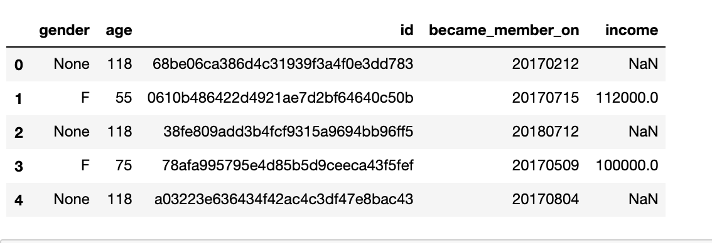
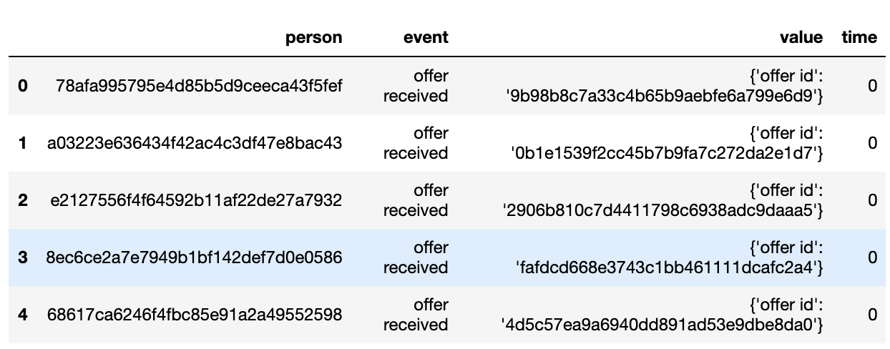
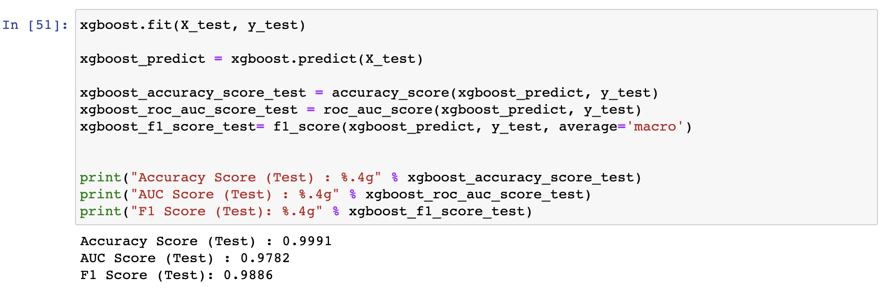

## Machine Learning Engineer Capstone Project
## Capstone Proposal
##### Yemi Awosanya 
###### April 23, 2021

### Table of Contents

#### 1. Project Overview
##### 1.1 Introduction
##### 1.2 Statement
##### 1.3 Datasets
#### 2. Project Analysis 
#### 3. Methodology
##### 3.1 Data Visualization
##### 3.2 Algorithms and Techniques
#### 4. Results
#### 5. Conclusion
#### 6. References 

#### Project Overview

##### Introduction
This data set contains simulated data that mimics customer behavior on the Starbucks rewards mobile app. Once every few days, Starbucks sends out an offer to users of the mobile app. An offer can be merely an advertisement for a drink or an actual offer such as a discount or BOGO (buy one get one free). Some users might not receive any offer during certain weeks.

Not all users receive the same offer, and that is the challenge to solve with this data set.

Your task is to combine transaction, demographic and offer data to determine which demographic groups respond best to which offer type. This data set is a simplified version of the real Starbucks app because the underlying simulator only has one product whereas Starbucks actually sells dozens of products.

Every offer has a validity period before the offer expires. As an example, a BOGO offer might be valid for only 5 days. You'll see in the data set that informational offers have a validity period even though these ads are merely providing information about a product; for example, if an informational offer has 7 days of validity, you can assume the customer is feeling the influence of the offer for 7 days after receiving the advertisement.

You'll be given transactional data showing user purchases made on the app including the timestamp of purchase and the amount of money spent on a purchase. This transactional data also has a record for each offer that a user receives as well as a record for when a user actually views the offer. There are also records for when a user completes an offer.

Keep in mind as well that someone using the app might make a purchase through the app without having received an offer or seen an offer.

##### Statement
Starbucks is passionate about improving and uplifting the lives of its customers, one beverage at a time. In doing so, they have created a mobile application that rewards and sends offers to their valued customers. The application offers promotions such as discounts or buy-one-get-one-free (BOGO), and occasionally, informational offers.

We used the study of consumer behavior to see how marketing campaigns can be adapted and improved to more effectively influence the consumer.

Because of Starbucks' dedication to their customers, we analyzed customer data to explore ways of improving their experience and to serve them better. 

##### Datasets
We have three datasets as follows:

**profile.json**

`Rewards program users (17000 users x 5 fields)`
- gender: (categorical) M, F, O, or null
- age: (numeric) missing value encoded as 118
- id: (string/hash)
- became_member_on: (date) format YYYYMMDD
- income: (numeric)
  

**portfolio.json**

`Offers sent during 30-day test period (10 offers x 6 fields)`

- reward: (numeric) money awarded for the amount spent
- channels: (list) web, email, mobile, social
- difficulty: (numeric) money required to be spent to receive reward
- duration: (numeric) time for offer to be open, in days
- offer_type: (string) bogo, discount, informational
- id: (string/hash)

**transcript.json**

`Event log (306648 events x 4 fields)`

- person: (string/hash)
- event: (string) offer received, offer viewed, transaction, offer completed
- value: (dictionary) different values depending on event type
- offer id: (string/hash) not associated with any "transaction"
- amount: (numeric) money spent in "transaction"
- reward: (numeric) money gained from "offer completed"
- time: (numeric) hours after start of test

##### Methodology

We followed the steps below to clean and process our datasets:

1. Check dataset content
2. Check data types
3. Check null/empty cells
4. Drop duplicate values, if applicable
5. Fill cell values, if applicable

##### Data Visualization
We started with data of over 300000 records. After cleaning the data, we were left with a total record number of 76277.

As part of the process, we plotted a few graphs to gain more insights to the customer data. We

Here, we have the age distrubution which indicates there a normal distribution with some outlier of age, 118.

In the income distribution graph, we can see that the income distribution is not sufficient enough to tell the user' story.

With the datasets, we used the preprocessor from sklearn, and we created new features. One of such feature was to determine and count successful offers within the alloted offer period. 

We adopted the 20/80 rule for splitting the training and test data sets.

##### Algorithms and Techniques

 we used the GradientBoostingClassifier as the benchmark model. 

 

 And, we choose xgboost as our final model to predict whether a customer accepts an offer or not.

 

#### Results
We used the following metrics to evaluate our model:
1. roc_auc_score - Area Under the Receiver Operating Characteristic Curve (ROC AUC) from prediction scores
2. accuracy_score - The number of correct predictions made divided by the total number of predictions made
3. f1_score - Weighted average of the precision and recall, where an F1 score reaches its best value at 1 

We used the sklearn xgboost tuning algorithm with the following hyperparameters

`Testing results for the 3 metrics listed above`

`Training results for the 3 metrics listed above`

#### Conclusion

True positive of 59542, False positive of 28, False negative of 254, True negative of 1197, it fair to assume the model predicts whether a customer will accept an offer or not, accurately. 

#### References

- [Feature Selection](https://towardsdatascience.com/feature-selection-techniques-in-machine-learning-with-python-f24e7da3f36e)
- [Evaluate Gradient Boosting Models](https://machinelearningmastery.com/evaluate-gradient-boosting-models-xgboost-python/)
- [Getting Started with XGBoost](https://towardsdatascience.com/getting-started-with-xgboost-in-scikit-learn-f69f5f470a97)
- [Categorical Data Encoding](https://www.analyticsvidhya.com/blog/2020/08/types-of-categorical-data-encoding/)